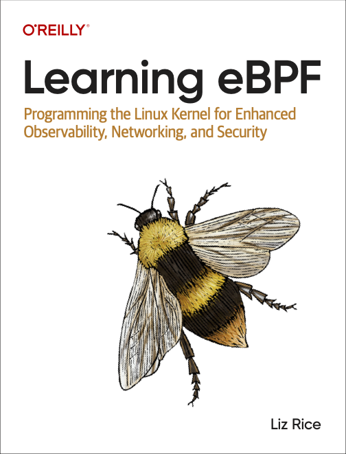

# Learning eBPF

This repo accompanies my new book [Learning
eBPF](https://www.amazon.com/Learning-eBPF-Programming-Observability-Networking/dp/1098135121)
(published by O'Reilly).



Buy your copy of the book from
[Bookshop.org](https://bookshop.org/p/books/learning-ebpf-programming-the-linux-kernel-for-enhanced-observability-networking-and-security-liz-rice/19244244?ean=9781098135126)
or
[Amazon](https://www.amazon.com/Learning-eBPF-Programming-Observability-Networking/dp/1098135121),
view it on the [O'Reilly platform](https://www.oreilly.com/library/view/learning-ebpf/9781098135119/), or download a copy from [Isovalent](https://isovalent.com/learning-ebpf). 

## Running the example code

The repo includes the example eBPF programs discussed in the book.

I've also provided a [Lima](https://github.com/lima-vm/lima) config file with
the packages you need for building the code pre-installed.

If you have a Linux machine or VM to hand, feel free to use that instead of
Lima, using the `learning-ebpf.yaml` file as a guide for the packages you'll 
need to install. The minimum kernel version required varies from chapter to chapter. All
these examples have been tested on an Ubuntu distribution using a 5.15 kernel. 

### Install this repo

```sh
git clone --recurse-submodules https://github.com/lizrice/learning-ebpf
cd learning-ebpf
```

### Lima VM

```sh
limactl start learning-ebpf.yaml
limactl shell learning-ebpf

# You'll need to be root for most of the examples
sudo -s
```

### Building libbpf and installing header files

Libbpf is included as a submodule in this repo. You'll need to build and install
it for the C-based examples to build correctly. (See libbpf/README.md for more
details.)

```sh
cd libbpf/src
make install 
cd ../..
```

### Building bpftool

There are several examples using `bpftool` throughout the book. To get a version
with libbfd support (which you'll need if you want to see the jited code in the 
Chapter 3 examples) you might need to build it from source:

```sh
cd ..
git clone --recurse-submodules https://github.com/libbpf/bpftool.git
cd bpftool/src 
make install 
```

## Examples

You won't be surprised to learn that the directories correspond to chapters in
the book. Here are the different examples that accompany each chapter.

* Chapter 1: What Is eBPF and Why Is It Important?
* [Chapter 2: eBPF's "Hello World"](chapter2/README.md) - Basic examples using the BCC framework.
* [Chapter 3: Anatomy of an eBPF Program](chapter3/README.md) - C-based XDP
  examples, used in the book to explore how the source code gets transformed to eBPF bytecode and
  machine code. There's also an example of BPF to BPF function calls.
* [Chapter 4: The bpf() System Call](chapter4/README.md) - More BCC-based examples, used in the book to
  illustrate what's happening at the syscall level when you use eBPF.
* [Chapter 5: CO-RE, BTF and Libbpf](chapter5/README.md) - Libbpf-based C
  example code.
* [Chapter 6: The eBPF Verifier](chapter6/README.md) - Make small edits to the
  example code to cause a variety of verifier errors!
* [Chapter 7: eBPF Program and Attachment Types](chapter7/README.md) - Examples
  of different eBPF program types.
* [Chapter 8: eBPF for Networking](chapter8/README.md) - Example code that
  attaches to various points in the network stack to interfere with ping and
  curl requests. *Coming soon, load balancer example*
* Chapter 9: eBPF for Security - *coming soon*
* [Chapter 10: eBPF Programming](chapter10/README.md) - The book explores examples from various eBPF
  libraries.
* Chapter 11: The Future Evolution of eBPF

There are no code examples for Chapters 1 and 11.

### Privileges

You'll need root privileges (well, strictly CAP_BPF and [additional
privileges](https://mdaverde.com/posts/cap-bpf/)) to be able to load BPF
programs into the kernel. `sudo -s` is your friend.

### View eBPF trace output

A couple of ways to see the output from the kernel's trace pipe where eBPF
tracing gets written:

* `cat /sys/kernel/debug/tracing/trace_pipe`
* `bpftool prog tracelog`

## Corrections

I'd love to hear if you find corrections and improvements for
these examples. Issues and PRs are welcome!
